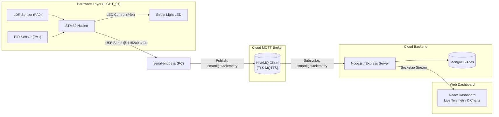

## Architecture Flowchart

```mermaid
flowchart LR
    subgraph Hardware ["Hardware Layer (LIGHT_01)"]
        direction TB
        LDR["LDR Sensor (PA0)"] --> STM["STM32 Nucleo"]
        PIR["PIR Sensor (PA1)"] --> STM
        STM -->|"LED Control (PB4)"| LED["Street Light LED"]
    end

    STM -->|"USB Serial @ 115200 baud"| Bridge["serial-bridge.js (PC)"]

    subgraph MQTT ["Cloud MQTT Broker"]
        HiveMQ[("HiveMQ Cloud\n(TLS MQTTS)")]
    end

    Bridge -->|"Publish: smartlight/telemetry"| HiveMQ

    subgraph Backend ["Cloud Backend"]
        direction TB
        Server["Node.js / Express Server"]
        Mongo[("MongoDB Atlas")]
        Server --> Mongo
    end

    HiveMQ -->|"Subscribe: smartlight/telemetry"| Server

    subgraph Frontend ["Web Dashboard"]
        Dashboard["React Dashboard\nLive Telemetry & Charts"]
    end

    Server -->|"Socket.io Stream"| Dashboard
```
